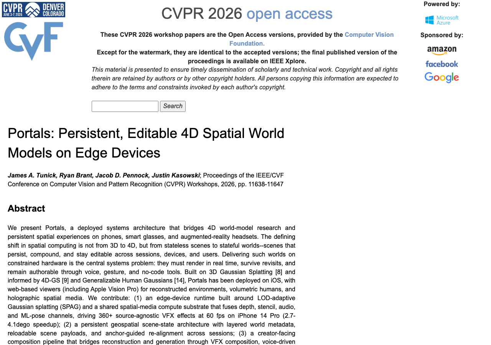
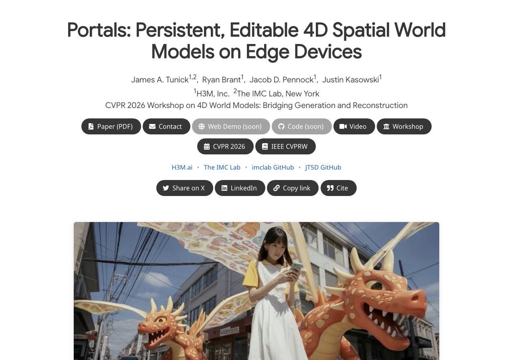

# Portals CVPR 2026 Project Page

Static GitHub Pages site for:

`Portals: Persistent, Editable 4D Spatial World Models on Edge Devices`

- Project page: https://imclab.github.io/portals-cvpr2026/
- Published paper (CVF Open Access): https://openaccess.thecvf.com/content/CVPR2026W/ReGen4D/html/Tunick_Portals_Persistent_Editable_4D_Spatial_World_Models_on_Edge_Devices_CVPRW_2026_paper.html

## Published paper

James A. Tunick, Ryan Brant, Jacob D. Pennock, Justin Kasowski. Proceedings of the IEEE/CVF Conference on Computer Vision and Pattern Recognition (CVPR) Workshops, 2026, pp. 11638-11647.

## Project page

## What this repo serves

This repo uses the same academic project page template family found in workshop speaker pages and serves:

- the landing page
- the paper PDF
- placeholder states for code and video
